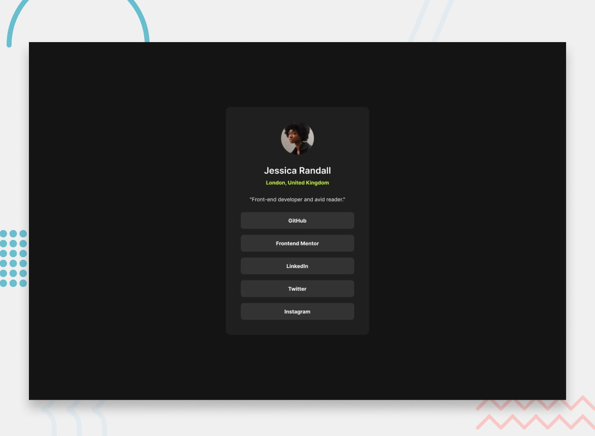

# Frontend Mentor - Social Links Profile Solution

This is my solution to the **Social Links Profile challenge** on Frontend Mentor. This project helped me practice building a clean profile card, working with CSS layouts, and adding interactive hover states.



## 📋 Overview

### The Challenge

The goal of this challenge was to build a social links profile card and make it look as close as possible to the provided Frontend Mentor design.

Users should be able to:

- View the layout correctly on different screen sizes
- See hover and focus states for interactive elements
- Easily access the social profile links
- View a clean and responsive profile card

## 🛠️ Built With

- Semantic HTML5
- CSS3
- Flexbox
- Responsive design
- CSS hover and focus states
- Google Fonts / local fonts

## 💡 What I Learned

While building this project, I practiced several important HTML and CSS concepts.

### Flexbox

I used Flexbox to center the profile card and organize elements inside it.

```css
body {
  display: flex;
  justify-content: center;
  align-items: center;
  min-height: 100vh;
}
```

### Hover States

I practiced creating interactive hover effects for the social links.

```css
.social-link:hover {
  background-color: hsl(75, 94%, 57%);
  color: hsl(0, 0%, 8%);
}
```

### Responsive Design

I also practiced making the card work properly on both desktop and mobile screen sizes.

## 🚧 Challenges I Faced

One of the main challenges I faced was getting the **spacing, padding, and positioning** to closely match the original design.

I also had to pay attention to:

- Correct spacing between elements
- Centering the profile card
- Styling the social link buttons
- Matching colors and typography
- Making the layout responsive
- Creating the correct hover states

These challenges helped me better understand how small CSS changes can have a big impact on the final design.

## 🤖 AI Assistance

I completed the project myself while using AI as a learning assistant when I got stuck.

For example, I used AI to help understand some CSS spacing and padding issues rather than having it build the entire project for me. This helped me understand **why** certain CSS properties were needed and how to fix layout problems.

## 📚 Continued Development

After completing this challenge, I want to continue improving my skills in:

- CSS Flexbox
- CSS Grid
- Responsive design
- Media queries
- Semantic HTML
- Accessibility
- Writing cleaner and reusable CSS

## 🔗 Links


- **Live Site URL:[https://navdeepsingh05117.github.io/Frontend-Mentor-CH-2/]
- **GitHub Repository:[https://github.com/navdeepsingh05117/Frontend-Mentor-CH-2.git] 

## 👤 Author

**Navdeep Singh**

- Frontend Mentor: Add your Frontend Mentor username
- GitHub: Add your GitHub username
- LinkedIn: Add your LinkedIn profile

## 🙏 Acknowledgments

Thanks to [Frontend Mentor](https://www.frontendmentor.io/) for providing this challenge and helping developers improve their frontend skills through practical projects.

---

⭐ This project is part of my frontend development learning journey.